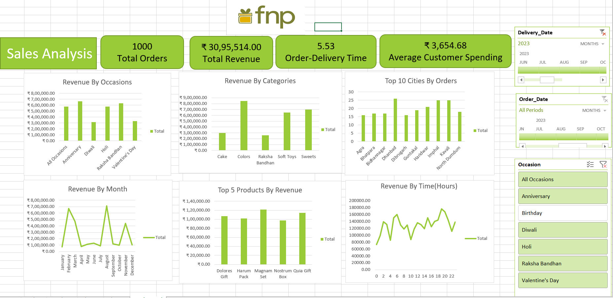

# FNP Sales Analysis Dashboard 📊

## 📌 Project Overview

This project analyzes FNP sales data using Microsoft Excel to identify
sales trends, customer behavior, popular products, occasions, categories,
cities, and order-delivery patterns.

An interactive Excel dashboard was created using Pivot Tables, Pivot Charts,
Slicers, and Excel formulas.

---

## 🎯 Problem Statement

The objective of this project is to analyze sales data and identify:

- Overall sales performance
- Revenue by occasion
- Revenue by product category
- Top-performing cities
- Monthly revenue trends
- Top products by revenue
- Revenue by hour
- Average customer spending
- Order-to-delivery time

---

## 📂 Dataset

The dataset contains information related to:

- Orders
- Customers
- Products
- Categories
- Occasions
- Cities
- Order dates
- Delivery dates
- Revenue
- Order and delivery time

---

## 🛠️ Tools & Technologies

- Microsoft Excel
- Pivot Tables
- Pivot Charts
- Slicers
- Excel Formulas
- Data Cleaning
- Data Analysis
- Data Visualization

---

## 🔄 Data Analysis Process

1. Data Collection
2. Data Cleaning
3. Data Transformation
4. Exploratory Data Analysis
5. Pivot Table Creation
6. Dashboard Development
7. Insights Generation

---

## 📊 Dashboard

The dashboard provides an interactive view of FNP sales performance.

### Key KPIs

- Total Orders: 1,000
- Total Revenue: ₹30,95,514
- Average Customer Spending: ₹3,654.68
- Average Order-Delivery Time: 5.53

### Dashboard Features

- Revenue by Occasion
- Revenue by Category
- Top 10 Cities by Orders
- Revenue by Month
- Top 5 Products by Revenue
- Revenue by Hour
- Occasion filter
- Order Date filter
- Delivery Date filter

---

## 📸 Dashboard Preview

---

## 💡 Key Insights

Some important insights obtained from the analysis include:

- Anniversary orders generate significant revenue.
- Colors is one of the highest-revenue categories.
- Certain cities contribute significantly to total orders.
- Revenue shows noticeable monthly fluctuations.
- Some products consistently appear among the top revenue-generating products.
- Sales vary significantly throughout the day.

---

## 🚀 How to Use

1. Download the Excel dashboard.
2. Open it using Microsoft Excel.
3. Use the slicers to filter the dashboard.
4. Analyze the charts and KPIs.

---

## 👨‍💻 Author

Nishchaya Khanna
